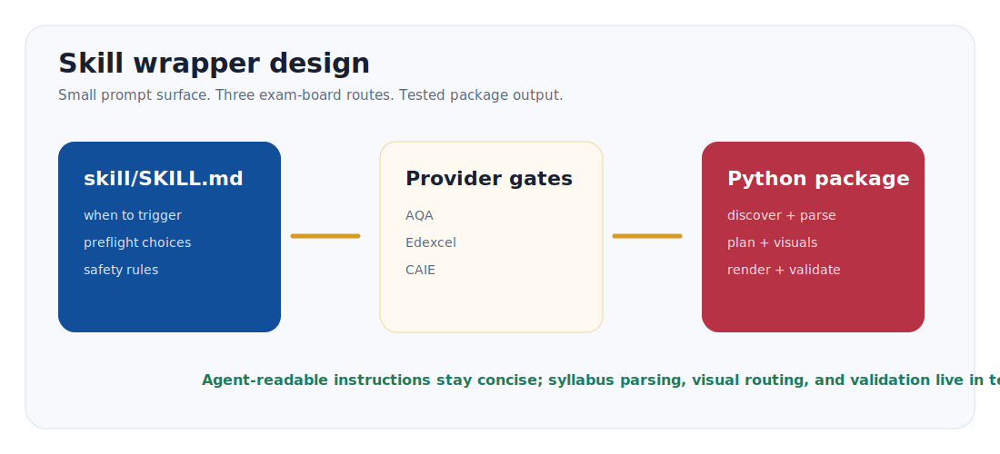
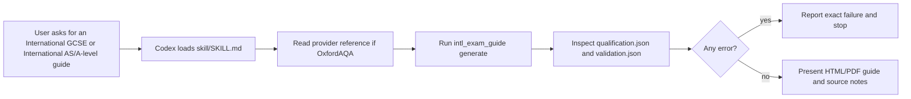
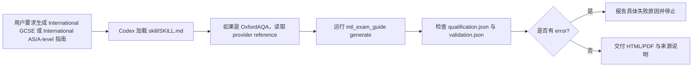

# Skill Explained / Skill 图解说明

<p align="center">
  
</p>

## English

The repository includes a Codex skill wrapper in `skill/`. The skill is designed
with progressive disclosure:

- `skill/SKILL.md` stays short and tells an agent when to use the tool.
- `skill/references/oxfordaqa.md` stores provider-specific quality gates.
- The Python package performs deterministic work: discovery, PDF download,
  parsing, guide planning, rendering, and validation.

This keeps the agent from re-writing fragile scraping or rendering code every
time. The agent reads the skill, runs the CLI, and inspects `validation.json`
before reporting success.

## Skill Workflow



## Quality Gates

The skill treats a guide as incomplete unless all of these are true:

1. The source page URL is present.
2. The specification PDF URL is present.
3. The PDF SHA-256 hash is recorded.
4. Topics were extracted.
5. Every topic has an authored guide block.
6. Every topic has practice cards with command words, solution steps, and answer checkpoints.
7. HTML exists and contains required guide sections.
8. PDF exists unless `--skip-pdf` was intentionally used.
9. `validation.json.review_summary` shows topic, diagram, practice-card, and
   source-snippet coverage.

For installation checks or CI demonstrations, run:

```bash
python -m intl_exam_guide demo --out ./outputs/demo-science --skip-pdf
```

## 中文

仓库内置 `skill/` 目录，用来作为 Codex skill。它遵循 progressive disclosure：

- `skill/SKILL.md` 保持简洁，只告诉 agent 什么时候使用、怎么运行。
- `skill/references/oxfordaqa.md` 存放 OxfordAQA 专属质量门槛。
- Python 包负责稳定且容易出错的部分：发现页面、下载 PDF、解析、规划、渲染、校验。

这样做的好处是：agent 不需要每次重新写爬取和渲染代码，而是读取 skill、
运行 CLI、检查 `validation.json`，再决定能否交付。

## Skill 执行流程



## 质量门槛

除非满足以下条件，否则 skill 不应把指南当作完成品：

1. 有 source page URL。
2. 有 specification PDF URL。
3. 记录了 PDF SHA-256。
4. 成功抽取 topics。
5. 每个 topic 都有 guide block。
6. 每个 topic 都有练习卡片，并包含 command word、解题步骤和答案检查点。
7. HTML 存在，并包含必要 sections。
8. 除非明确使用 `--skip-pdf`，否则 PDF 必须存在。
9. `validation.json.review_summary` 显示 topic、diagram、practice card 和
   source snippet 覆盖度。
